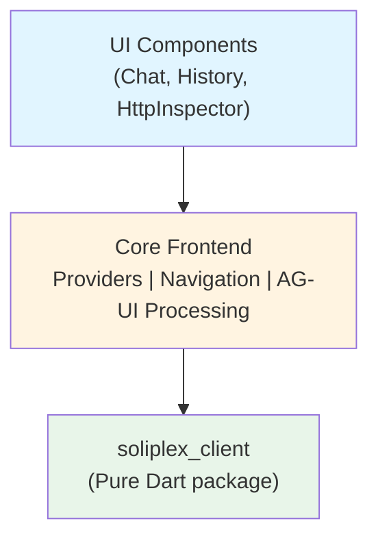
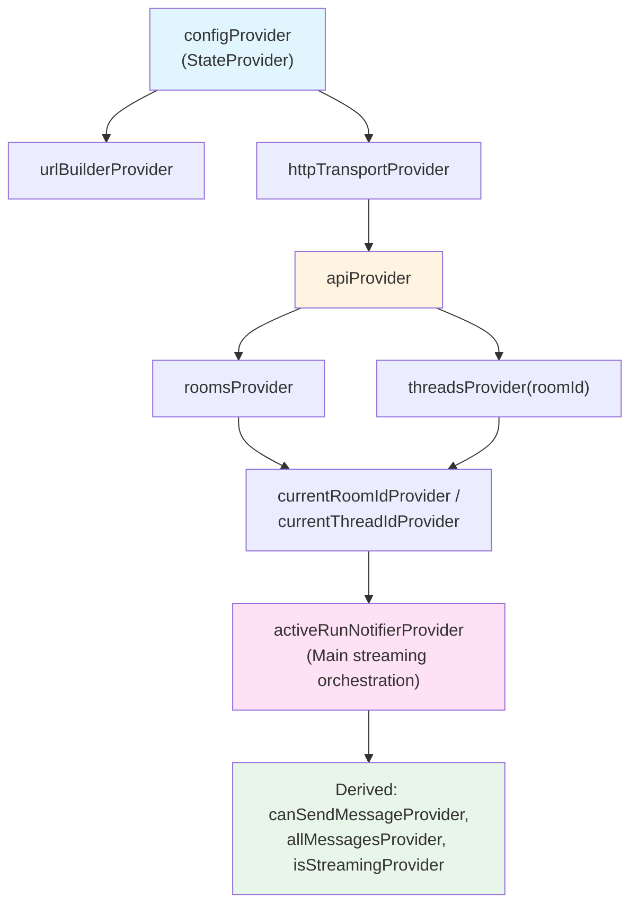
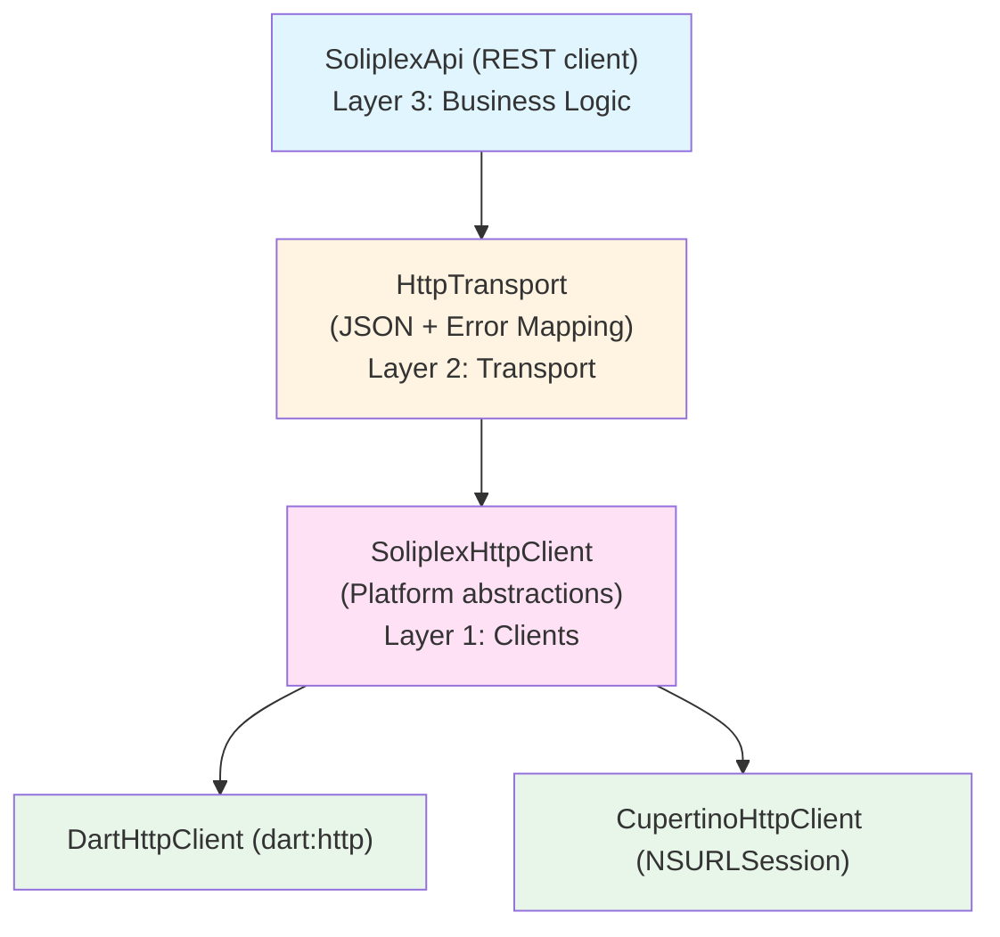
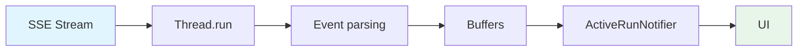
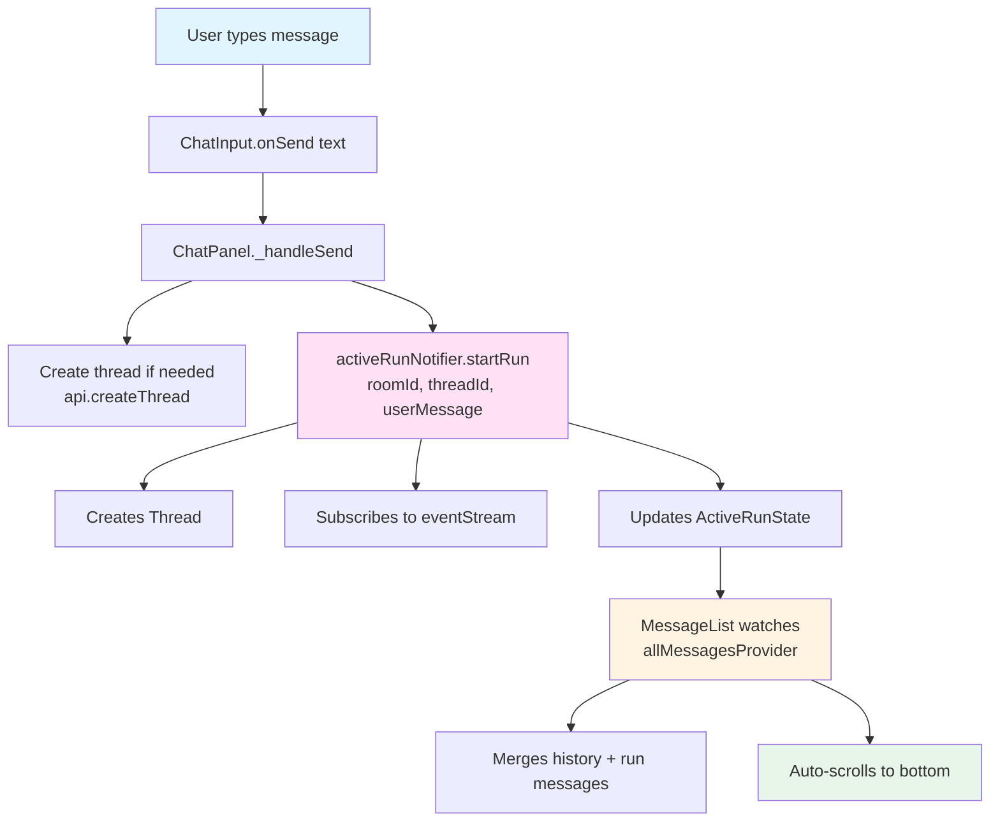

# Soliplex Frontend Codebase Analysis

**Last updated:** January 2026

> **Note:** File counts and structure in this document reflect the codebase as of the last update.
> Run `find lib -name "*.dart" | wc -l` to get current counts.

## 1. Project Structure

```text
frontend/
├── lib/                              # Main Flutter app (~79 Dart files)
│   ├── main.dart                     # Entry point with ProviderScope
│   ├── app.dart                      # Root SoliplexApp widget
│   ├── core/                         # Infrastructure layer
│   │   ├── auth/                     # Authentication (14 files)
│   │   │   ├── auth_state.dart       # Sealed class: Unauthenticated|Authenticated|AuthLoading|NoAuthRequired
│   │   │   ├── auth_provider.dart    # Main auth notifier provider
│   │   │   ├── auth_notifier.dart    # Auth state management
│   │   │   ├── auth_flow*.dart       # Platform-specific OAuth flows (native, web)
│   │   │   ├── auth_storage*.dart    # Platform-specific token storage (native, web)
│   │   │   └── oidc_issuer.dart      # OIDC issuer management
│   │   ├── models/                   # Core data models
│   │   │   ├── active_run_state.dart # Sealed class: IdleState|RunningState|CompletedState
│   │   │   └── app_config.dart       # App configuration (baseUrl)
│   │   ├── providers/                # Riverpod state management (12 providers)
│   │   │   ├── api_provider.dart     # SoliplexApi with HTTP transport
│   │   │   ├── active_run_provider.dart
│   │   │   ├── active_run_notifier.dart
│   │   │   ├── config_provider.dart
│   │   │   ├── rooms_provider.dart
│   │   │   ├── threads_provider.dart
│   │   │   ├── thread_message_cache.dart
│   │   │   ├── backend_health_provider.dart
│   │   │   ├── backend_version_provider.dart
│   │   │   ├── http_log_provider.dart
│   │   │   ├── package_info_provider.dart
│   │   │   └── quiz_provider.dart
│   │   ├── router/
│   │   │   └── app_router.dart       # GoRouter (8 routes)
│   │   └── constants/
│   │       └── breakpoints.dart      # Responsive breakpoints
│   ├── features/                     # Feature screens
│   │   ├── auth/                     # OAuth callback handler
│   │   ├── home/                     # Backend URL configuration
│   │   ├── login/                    # OIDC login UI
│   │   ├── rooms/                    # Room list
│   │   ├── room/                     # Room view with threads
│   │   ├── chat/                     # Chat messaging (4 files)
│   │   ├── history/                  # Thread list sidebar (3 files)
│   │   ├── inspector/                # HTTP traffic debugger (5 files)
│   │   └── settings/                 # Settings screen
│   └── shared/                       # Reusable components
│       ├── widgets/                  # AppShell, AsyncValueHandler, etc.
│       └── utils/                    # Date formatting, utilities
│
├── packages/soliplex_client/         # Pure Dart package (NO Flutter, ~34 files)
│   ├── lib/src/
│   │   ├── api/                      # REST API client
│   │   ├── application/              # AG-UI application facade
│   │   ├── auth/                     # OIDC discovery, token refresh
│   │   ├── domain/                   # Data models
│   │   ├── http/                     # HTTP abstraction layer
│   │   ├── errors/                   # Exception hierarchy
│   │   └── utils/                    # Utilities
│   └── test/                         # ~23 test files
│
├── packages/soliplex_client_native/  # Flutter package - Native HTTP (~8 files)
│   └── lib/src/
│       ├── platform/                 # Platform-specific factory
│       └── clients/                  # CupertinoHttpClient for iOS/macOS
│
├── test/                             # Widget and unit tests (~42 files)
├── android/, ios/, macos/, web/      # Platform-specific code
└── pubspec.yaml
```

## 2. Architecture

### 2.1 Three-Layer Design



### 2.2 State Management: Riverpod

**Provider Hierarchy:**



### 2.3 HTTP Layer Architecture



### 2.4 Navigation: GoRouter

| Route | Screen | Description |
|-------|--------|-------------|
| `/` | HomeScreen | Backend URL configuration |
| `/login` | LoginScreen | OIDC provider selection |
| `/auth/callback` | AuthCallbackScreen | OAuth callback handler |
| `/rooms` | RoomsScreen | List all rooms |
| `/rooms/:roomId` | RoomScreen | Room view with thread selection |
| `/rooms/:roomId/thread/:threadId` | (redirect) | Redirects to `/rooms/:roomId?thread=:threadId` |
| `/settings` | SettingsScreen | App config and auth status |

**Responsive Layout:**

- Desktop (≥600px): Sidebar history panel + chat panel side-by-side
- Mobile (<600px): Chat panel only

## 3. Key Components

### 3.1 Data Models

**ChatMessage:**

```dart
- id: String
- user: ChatUser (user | assistant | system)
- type: MessageType (text | error | toolCall | genUi | loading)
- text: String?
- isStreaming: bool
- thinkingText: String?
- toolCalls: List<ToolCallInfo>?
- errorMessage: String?
- createdAt: DateTime
```

**ActiveRunState (sealed class hierarchy):**

```dart
sealed class ActiveRunState {
  Conversation get conversation;
  StreamingState get streaming;
  List<ChatMessage> get messages;
  bool get isRunning;
}

class IdleState extends ActiveRunState { }      // No active run
class RunningState extends ActiveRunState {     // Run executing
  String get threadId;
  String get runId;
  bool get isStreaming;
}
class CompletedState extends ActiveRunState {   // Run finished
  CompletionResult result;  // Success | FailedResult | CancelledResult
}
```

### 3.2 AG-UI Protocol

**Event Types (sealed class hierarchy):**

- Run lifecycle: `RunStartedEvent`, `RunFinishedEvent`, `RunErrorEvent`
- Message streaming: `TextMessageStartEvent`, `TextMessageContentEvent`, `TextMessageEndEvent`
- Tool calls: `ToolCallStartEvent`, `ToolCallArgsEvent`, `ToolCallEndEvent`, `ToolCallResultEvent`
- State: `StateSnapshotEvent`, `StateDeltaEvent`
- Activity: `ActivitySnapshotEvent`, `ActivityDeltaEvent`
- Messages: `MessagesSnapshotEvent`
- Custom: `CustomEvent`, `UnknownEvent`

**Streaming Pipeline:**



### 3.3 Chat Flow



## 4. soliplex_client Package

**Pure Dart** - no Flutter dependency. Reusable on web, server, or desktop.

**Implemented Components:**

- Models & errors
- HTTP adapter interface + DartHttpAdapter
- HttpObserver + ObservableHttpAdapter
- HttpTransport, UrlBuilder, CancelToken
- API layer (SoliplexApi)
- AG-UI protocol (Thread, buffers, tool registry)

**Test Coverage:** ~600 tests, near 100% coverage

## 5. UI Components

### Screens

| Screen | Purpose |
|--------|---------|
| HomeScreen | Backend URL configuration |
| LoginScreen | OIDC provider selection |
| AuthCallbackScreen | OAuth callback handler |
| RoomsScreen | List rooms from API |
| RoomScreen | Room view with thread selection |
| SettingsScreen | App config and auth status |
| BackendVersionsScreen | Backend version information |
| QuizScreen | Quiz feature |

### Panels

| Panel | Purpose |
|-------|---------|
| ChatPanel | Message list + input, send/cancel/error handling |
| HistoryPanel | Thread list, new conversation, auto-selection |
| HttpInspectorPanel | HTTP traffic debugging with request grouping |

### Shared Widgets

- `AppShell`: Main scaffold with AppBar/Sidebar
- `AsyncValueHandler`: Wraps AsyncValue with error handling
- `ErrorDisplay`: Exception-aware error UI with retry
- `LoadingIndicator`: Spinner with optional message
- `EmptyState`: Icon + message for empty lists

## 6. Testing

**Test Coverage:**

- Frontend: ~42 test files covering auth, providers, features, widgets
- soliplex_client: ~23 test files
- Zero analyzer issues

**Test Structure:**

```text
test/
├── core/
│   ├── auth/              # Auth layer tests (9 files)
│   ├── models/            # Model tests
│   └── providers/         # Provider tests (7 files)
├── features/              # Screen and widget tests
│   ├── auth/
│   ├── chat/
│   ├── history/
│   ├── home/
│   ├── inspector/
│   ├── login/
│   ├── room/
│   ├── rooms/
│   └── settings/
├── shared/                # Shared widget tests
└── helpers/               # Mocks and utilities
```

**Key Utilities:**

- `MockSoliplexApi`: Mock API for testing
- `MockActiveRunNotifier`: Mock notifier with initial state
- `createTestApp()`: Helper to create testable app

## 7. Code Quality

**Analyzer:** Zero tolerance - no errors, warnings, or hints

**Linting:**

- `very_good_analysis` (strict rules)
- `dart format lib test` before commits
- `markdownlint-cli` for markdown

**Conventions:**

- PascalCase: Classes, enums, types
- camelCase: Variables, functions
- `_privateMethod`: Private members prefixed

## 8. Notable Patterns

### Sealed Classes for Events

```dart
sealed class AgUiEvent { ... }
final class RunStartedEvent extends AgUiEvent { ... }
// Enables exhaustive pattern matching
```

### Builder Pattern for Models

```dart
ChatMessage.text(...)
ChatMessage.error(...)
ChatMessage.toolCall(...)
```

### Observer Pattern for HTTP

`ObservableHttpAdapter` wraps adapters for request inspection/logging.

### Cancel Token

Graceful SSE stream cancellation via `Completer` pattern.

### Responsive Breakpoint

600px mobile/desktop boundary in ThreadScreen.

## 9. Dependencies

**Frontend App:**

```yaml
flutter_riverpod: ^3.1.0       # State management
go_router: ^17.0.0             # Navigation
flutter_appauth: ^11.0.0       # OIDC flows
flutter_secure_storage: ^10.0.0 # Secure token storage
shared_preferences: ^2.5.4     # Config persistence
package_info_plus: ^9.0.0      # App version info
http: ^1.2.0                   # HTTP client
flutter_markdown: ^0.7.4+1     # Message rendering
flutter_highlight: ^0.7.0      # Code highlighting
intl: ^0.20.1                  # Localization
meta: ^1.15.0                  # Annotations
soliplex_client: path          # Pure Dart client
soliplex_client_native: path   # Native adapters
```

**soliplex_client:**

```yaml
http: ^1.2.0
meta: ^1.9.0
```

**soliplex_client_native:**

```yaml
cupertino_http: ^2.0.0      # NSURLSession
flutter: >= 3.10.0
http: ^1.2.0
```

## 10. Key Architectural Decisions

1. **Pure Dart client package** - Reusable across platforms without Flutter dependency
2. **Sealed classes for state** - Type-safe exhaustive pattern matching (ActiveRunState, AuthState, CompletionResult)
3. **3-layer HTTP abstraction** - Testable adapters, transport, and API layers
4. **Platform-optimized adapters** - NSURLSession on iOS/macOS for better performance
5. **Platform-specific auth** - Native Keychain/SecureStorage vs Web localStorage
6. **Manual Riverpod providers** - Explicit control over provider lifecycle
7. **Responsive dual-panel layout** - Desktop sidebar with mobile fallback

## 11. Summary

This is a well-architected, production-quality Flutter frontend featuring:

- ✅ Clean 3-layer HTTP abstraction with platform adapters
- ✅ Pure Dart client package reusable across platforms
- ✅ Sophisticated AG-UI event streaming protocol
- ✅ Responsive dual-panel desktop + mobile chat
- ✅ OIDC authentication with platform-specific flows
- ✅ HTTP traffic inspector for debugging
- ✅ Comprehensive error handling with exception hierarchy
- ✅ Strict code quality (zero analyzer issues)
- ✅ Riverpod state management with clear provider hierarchy
- ✅ Sealed classes for type-safe state handling
- ✅ Platform-optimized native HTTP adapters
