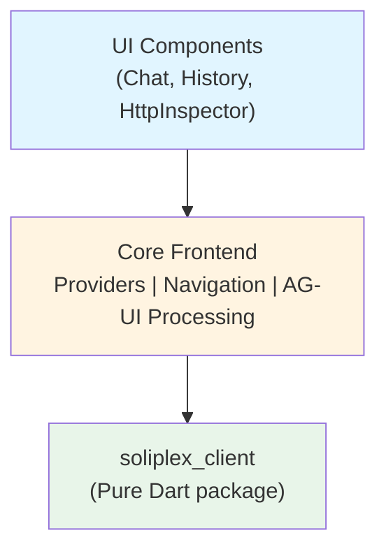

# Soliplex Flutter Documentation

This documentation covers the Soliplex Flutter frontend - a cross-platform chat application with AG-UI streaming protocol support.

The current frontend focuses on core chat functionality with essential features implemented.

## Quick Links

| Area | Description |
|------|-------------|
| [Developer Setup](guides/developer-setup.md) | Environment setup and getting started |
| [Codebase Analysis](CODEBASE_ANALYSIS.md) | Project structure and architecture |
| [Flutter Rules](rules/flutter_rules.md) | Development conventions and best practices |
| [Client Package](summary/client.md) | Pure Dart client library documentation |

---

## Documentation Sections

### Guides

- [Developer Setup](guides/developer-setup.md) - Environment setup, dependencies, and build instructions

### Rules & Standards

- [Flutter Rules](rules/flutter_rules.md) - Flutter development conventions and best practices

### Package Documentation

- [Client Package](summary/client.md) - soliplex_client architecture and usage

---

## Project Overview

### Architecture

The project follows a three-layer architecture:

### Packages

| Package | Type | Status | Description |
|---------|------|--------|-------------|
| `soliplex_client` | Pure Dart | Implemented | HTTP/AG-UI client, models, sessions |
| `soliplex_client_native` | Flutter | Implemented | Native HTTP adapters (iOS/macOS via Cupertino) |

### Implemented Features

- Chat with streaming AI responses
- Thread history with management
- HTTP traffic inspector
- OIDC authentication
- Multi-room support
- Quiz feature
- Responsive layout (desktop/mobile)
