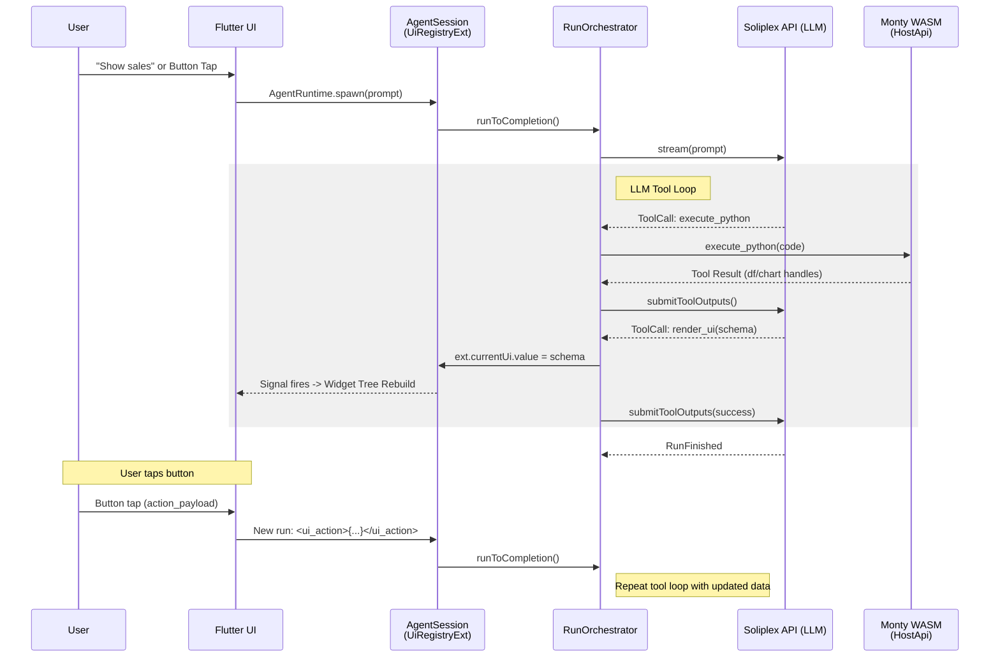

# Flutter Widget Tree from Python: Architecture Plan

**Date:** 2026-03-06
**Source:** 5 rounds of Gemini 3.1 Pro analysis against production soliplex_agent code
**Status:** PROPOSAL — ready for team review

## Summary

Extend the proven Monty LLM→Python→Dart pipeline to generate Flutter UIs.
The LLM generates Python that processes data, then calls `render_ui(schema)`
with a JSON dict that Flutter renders into a widget tree. User interactions
(button taps) route back as messages to the orchestrator, triggering new
LLM turns that update the UI declaratively.

## Key Architecture Decisions

1. **Single `render_ui(schema)` tool** — not many widget_create/update calls.
   LLM declares the full UI in one JSON dict (like React). No imperative updates.
2. **Button actions as user messages** — button taps become `<ui_action>{...}</ui_action>`
   messages to the orchestrator. No WASM reentrancy needed.
3. **DataFrame handles AS state** — widgets bind to existing df handles.
   No new state primitives needed.
4. **Session-scoped via UiRegistryExtension** — widget lifecycle tied to AgentSession.
   Session dispose clears all widget state.

## What the LLM Generates

### System Prompt (UI Agent)

```text
You are an expert Data Visualization and UI Agent.
Your primary function is to analyze data and present it using interactive
UI components.

## AVAILABLE TOOLS
You have access to specific tools. Use `execute_python` to process data,
and `render_ui` to display it.

## UI SCHEMA RULES
When calling `render_ui`, you must provide a valid JSON schema representing
the interface. The host application will natively render this into widgets.

Supported widget types:
1. "text": {"type": "text", "content": "Hello", "style": "heading|body"}
2. "button": {"type": "button", "label": "Click Me", "action_payload": {...}}
3. "row" / "column": {"type": "row", "children": [<widgets>]}
4. "dataframe": {"type": "dataframe", "handle": <int>}
5. "chart": {"type": "chart", "handle": <int>}

## WORKFLOW
1. If the user asks to analyze data, FIRST use `execute_python` to
   load/process the data and generate chart/dataframe handles.
2. THEN, use `render_ui` to layout the results.

## INTERACTION RULES
- When you receive a `<ui_action>`, process the requested action and
  MUST call `render_ui` again to update the view.
- NEVER invent widget types not listed above.
- NEVER return raw code. Always use `render_ui` to show results.

## EXAMPLE
User: "Show me a dashboard of recent sales."
Action:
1. Tool: execute_python (processes sales, gets chart handle 101, df handle 102)
2. Tool: render_ui with schema:
{
  "type": "column",
  "children": [
    {"type": "text", "content": "Sales Dashboard", "style": "heading"},
    {"type": "chart", "handle": 101},
    {"type": "row", "children": [
      {"type": "text", "content": "Raw Data:", "style": "body"},
      {"type": "button", "label": "Export", "action_payload": {"type": "export"}}
    ]},
    {"type": "dataframe", "handle": 102}
  ]
}
```

## Package Boundaries

| Package | What goes here |
|---------|---------------|
| **soliplex_agent** (pure Dart) | `UiApi` abstract interface (registerWidgetTree, updateWidgetTree). SessionExtension for UI lifecycle. |
| **soliplex_scripting** (pure Dart) | Wire `render_ui` host function to UiApi |
| **soliplex_interpreter_monty** (pure Dart) | Nothing new — Monty already handles host function calls |
| **Flutter app (lib/)** | `WidgetRegistry`, recursive `DynamicWidget` renderer, concrete UiApi implementation |

## The render_ui Tool Implementation

```dart
class UiRegistryExtension implements SessionExtension {
  final Signal<Map<String, dynamic>?> currentUi = signal(null);

  late final List<ClientTool> tools = [
    ClientTool.simple(
      name: 'render_ui',
      description: 'Renders a UI based on a JSON schema.',
      parameters: {
        'type': 'object',
        'properties': {
          'schema': {'type': 'object', 'description': 'The widget schema.'}
        },
        'required': ['schema'],
      },
      executor: _executeRenderUi,
    ),
  ];

  Future<String> _executeRenderUi(ToolCallInfo toolCall, ToolExecutionContext ctx) async {
    final args = jsonDecode(toolCall.arguments) as Map<String, dynamic>;
    currentUi.value = args['schema'] as Map<String, dynamic>;
    return 'UI rendered. Awaiting user interaction.';
  }

  @override
  void onDispose() => currentUi.dispose();
}
```

## The Button Action Loop

```text
1. User taps button with action_payload: {"action": "drill", "region": "West"}
2. Flutter formats as user message: <ui_action>{"action": "drill", "region": "West"}</ui_action>
3. AgentRuntime.spawn() on same threadId -> new AgentSession
4. LLM sees the action, calls execute_python to filter data
5. LLM calls render_ui with updated schema
6. Flutter rebuilds from new Signal value
```

## Complete Drill-Down Flow

```text
Run 1:
  User: "Show me sales by region"
  LLM -> execute_python: creates df, chart handle 4
  LLM -> render_ui: { column: [chart(4), button("Drill West", payload)] }
  Flutter: renders dashboard

Run 2 (user clicks "Drill into West"):
  User: <ui_action>{"action": "drill", "region": "West"}</ui_action>
  LLM -> execute_python: filters to West, chart handle 5
  LLM -> render_ui: { column: [chart(5), button("Back", payload)] }
  Flutter: renders updated dashboard
```

## WASM Implications

| Capability | Why WASM matters |
|-----------|-----------------|
| Zero-latency offline | Cached Python scripts run in 10ms, no LLM round-trip |
| Data privacy | LLM writes instructions; raw data never hits server |
| Real-time interaction | Button taps processed client-side without network |
| Edge deployment | Full agent stack runs in browser with no backend |

## What NOT to Build

1. **No fine-grained UI tools** (update_button_color, hide_widget) — always
   re-declare full schema via render_ui
2. **No WASM suspend/resume** — scripts run to completion, exit, let LLM
   decide next step
3. **No Flutter-side validation** — send raw form data to Python/LLM layer
4. **No blocking Dart on WASM** — execute_python must be fully async

## MVP: 1-Week Prototype

**Goal:** LLM generates Python → processes data → renders dashboard with
chart, data table, and filter button → user clicks filter → UI updates.

### Files to create or modify

1. `soliplex_agent/.../ui_api.dart` — abstract interface
2. `soliplex_scripting/.../host_function_wiring.dart` — add 'widget' category
3. `lib/features/dynamic_ui/dynamic_widget.dart` — recursive renderer
4. `lib/features/dynamic_ui/widget_registry.dart` — handle-based store
5. Room config: `example/rooms/ui-agent/prompt.txt` — UI agent system prompt

### Supported widgets for MVP

Column, Row, Text, Button, DataTable (from df handle), Chart (from chart handle)

## Architecture Diagram



## References

- Monty spike results: [OVERVIEW.md](https://github.com/runyaga/soliplex/blob/feat/soliplex-cli-monty/example/spike-prompts/OVERVIEW.md)
- Function enumeration finding: [soliplex/soliplex#671](https://github.com/soliplex/soliplex/issues/671)
- Schema mismatch analysis: `/Users/runyaga/dev/soliplex-plans/schema-mismatch-problem-2026-03-06.md`
- Experiment results: `/Users/runyaga/dev/soliplex-plans/experiment-results-2026-03-06.md`
