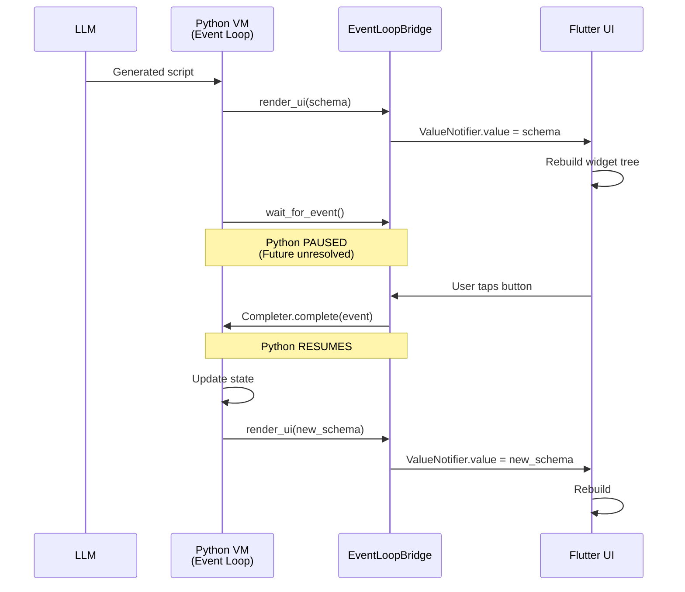

# Pure Dart Scripting Extensions: Architecture Proposal

**Date:** 2026-03-06
**Source:** 3 rounds of Gemini 3.1 Pro analysis against dart_monty + soliplex_interpreter_monty + soliplex_scripting
**Status:** PROPOSAL — ready for team review

## Summary

Transform the dart_monty runtime into a **React-like framework where Python is
the stateful ViewModel, Flutter is the View, and the LLM is the developer.**

Three extensions combine into a unified architecture:

1. **Event Loop Protocol** — Python holds state and responds to UI events via
   `wait_for_event()`, using only existing start/resume (zero Rust changes)
2. **Plugin System** — Extensible `MontyPlugin` interface with auto-generated
   LLM system prompts from function schemas
3. **render_ui integration** — Declarative widget trees from the existing
   flutter-widget-tree plan, now reactive via Python-held state

## Directions Evaluated

| Direction | Feasibility | LLM Impact | Verdict |
|-----------|-------------|------------|---------|
| A. Expose Dart stdlib via host functions | Easy | Neutral/Worse | Low priority — LLMs trained on Python stdlib |
| B. Make interpreter internals scriptable | Hard | Worse | Defer — requires Rust changes |
| C. Dart-like syntax ("DartScript") | Impossible | Worse | Rejected — requires Monty rewrite |
| **D. Bidirectional bridge (event loop)** | **Medium** | **Better** | **BUILD — zero Rust changes** |
| **E. Plugin system** | **Easy** | **Significantly better** | **BUILD — highest ecosystem impact** |

## Package Boundaries

| Package | Responsibility |
|---------|---------------|
| **dart_monty** | Raw FFI/WASM bindings and MontyHandle interface. Zero changes needed. |
| **monty_bridge** (new, pure Dart) | EventLoopBridge, plugin interfaces, auto-prompt generation. No Flutter dependency. |
| **monty_plugins** (new, pure Dart) | Standard library plugins (DataFrame, HTTP, FS). |
| **flutter_monty** (new, Flutter) | MontyDynamicWidget, ValueNotifier integrations, UI Plugin (render_ui host function). |
| **soliplex_agent** | LLM orchestration. Feeds PluginRegistry schemas into system prompt. |

## The MontyPlugin Interface

```dart
abstract class MontyPlugin {
  /// Namespace prefix for all functions (e.g., "ui", "df", "sqlite")
  String get namespace;

  /// Human-readable instructions appended to the LLM's system prompt
  String get systemPromptContext;

  /// The list of host functions this plugin provides
  List<HostFunction> get functions;

  /// Called when the bridge initializes
  Future<void> onRegister(EventLoopBridge bridge) async {}

  /// Called when the session ends
  Future<void> onDispose() async {}
}
```

## The Plugin Registry

```dart
class PluginRegistry {
  final List<MontyPlugin> _plugins = [];

  void register(MontyPlugin plugin) => _plugins.add(plugin);

  Future<void> attachTo(EventLoopBridge bridge) async {
    for (final plugin in _plugins) {
      await plugin.onRegister(bridge);
      for (final fn in plugin.functions) {
        bridge.register(fn);
      }
    }
  }

  /// Auto-generates LLM system prompt from registered plugin schemas
  String generateSystemPrompt() {
    final buffer = StringBuffer();
    buffer.writeln("You are a system-level agent writing Monty Python scripts.");
    buffer.writeln("Available Namespaces & Rules:\n");

    for (final p in _plugins) {
      buffer.writeln("### ${p.namespace.toUpperCase()}");
      buffer.writeln(p.systemPromptContext);
      for (final f in p.functions) {
        buffer.writeln("- `${f.schema.name}`: ${f.schema.description}");
      }
      buffer.writeln();
    }
    return buffer.toString();
  }
}
```

## The Event Loop Protocol (Zero Rust Changes)

Key insight: `wait_for_event` is a host function that returns an unresolved
Future. When the user taps a button in Flutter, Dart resolves that Future,
unpausing the Python VM. Uses only existing start/resume mechanism.

```dart
class EventLoopBridge extends DefaultMontyBridge {
  final _eventQueue = StreamController<Map<String, dynamic>>();
  Completer<Map<String, dynamic>>? _pendingEventCompleter;

  // Expose current UI state to Flutter
  final ValueNotifier<Map<String, dynamic>?> currentUi = ValueNotifier(null);

  EventLoopBridge() : super(useFutures: true) {
    // The blocking wait_for_event function
    register(HostFunction(
      schema: const HostFunctionSchema(
        name: 'wait_for_event',
        description: 'Yields execution until a UI event occurs.',
      ),
      handler: (args) async {
        _pendingEventCompleter = Completer<Map<String, dynamic>>();
        return await _pendingEventCompleter!.future;
      },
    ));

    // The render_ui function
    register(HostFunction(
      schema: const HostFunctionSchema(name: 'render_ui'),
      handler: (args) async {
        currentUi.value = args['schema'] as Map<String, dynamic>;
        return true;
      },
    ));
  }

  /// Called by Flutter when user interacts with generated UI
  void dispatchUiEvent(Map<String, dynamic> event) {
    if (_pendingEventCompleter != null &&
        !_pendingEventCompleter!.isCompleted) {
      _pendingEventCompleter!.complete(event);
      _pendingEventCompleter = null;
    } else {
      _eventQueue.add(event);
    }
  }
}
```

## Complete Example Flow

### 1. LLM generates the script

```python
state = {"counter": 0}

def update_ui():
    render_ui({
        "type": "column",
        "children": [
            {"type": "text", "content": f"Count is: {state['counter']}"},
            {"type": "button", "action_id": "increment_btn", "label": "Add 1"}
        ]
    })

# Initial render
update_ui()

# The Event Loop
while True:
    event = wait_for_event()  # Python pauses here!

    if event.get("action_id") == "increment_btn":
        state["counter"] += 1
        update_ui()
```

### 2. Execution flow

```text
1. Dart runs the Python script. Python calls update_ui().
2. render_ui updates the ValueNotifier.
3. Flutter's ValueListenableBuilder rebuilds, showing Text and Button.
4. Python hits wait_for_event() and PAUSES via Dart's Future system.
5. User taps "Add 1" button in Flutter.
6. Flutter calls bridge.dispatchUiEvent({"action_id": "increment_btn"}).
7. The Dart Completer resolves. Python VM resumes!
8. Python increments state["counter"], calls render_ui() again.
9. Flutter updates instantly.
```

### 3. Sequence diagram



## Example Plugin: SQLite

### Package structure

```text
monty_plugin_sqlite/
  pubspec.yaml
  lib/
    monty_plugin_sqlite.dart
```

### pubspec.yaml

```yaml
name: monty_plugin_sqlite
description: SQLite plugin for the Monty Python execution environment.
dependencies:
  soliplex_interpreter_monty: ^1.0.0
  sqflite: ^2.3.0
```

### Implementation

```dart
class SqlitePlugin implements MontyPlugin {
  late Database _db;

  @override
  String get namespace => 'sqlite';

  @override
  String get systemPromptContext =>
      'Local relational database access via SQLite.';

  @override
  Future<void> onRegister(EventLoopBridge bridge) async {
    _db = await openDatabase('monty_db.db', version: 1,
        onCreate: (db, v) =>
            db.execute('CREATE TABLE cache (key TEXT, val TEXT)'));
  }

  @override
  void onDispose() => _db.close();

  @override
  List<HostFunction> get functions => [
    HostFunction(
      schema: const HostFunctionSchema(
        name: 'sqlite_execute',
        description: 'Execute a write query (INSERT/UPDATE/DELETE).',
        params: [
          HostParam(name: 'query', type: HostParamType.string),
        ],
      ),
      handler: (args) async {
        await _db.execute(args['query'] as String);
        return {'status': 'success'};
      },
    ),
    HostFunction(
      schema: const HostFunctionSchema(
        name: 'sqlite_query',
        description: 'Execute a read query, returns list of row dicts.',
        params: [
          HostParam(name: 'query', type: HostParamType.string),
        ],
      ),
      handler: (args) async {
        return await _db.rawQuery(args['query'] as String);
      },
    ),
  ];
}
```

### Registration in app

```dart
void main() async {
  final registry = PluginRegistry();
  await registry.register(SqlitePlugin());
  await registry.register(DataframePlugin());
  await registry.register(UiPlugin());

  final bridge = EventLoopBridge();
  await registry.attachTo(bridge);

  // Auto-generated prompt includes all plugin schemas
  final systemPrompt = registry.generateSystemPrompt();

  runApp(MyApp(bridge: bridge, systemPrompt: systemPrompt));
}
```

## What This Enables (Previously Impossible)

1. **Client-side reactive LLM apps** — LLM generates a functional, stateful
   app that runs entirely locally at 60fps. No internet needed for button taps.
2. **Trivial state management** — Python holds a dict (`state = {}`), mutates
   it, pushes new JSON schema. Perfectly analogous to React's `setState`.
3. **Zero WASM reentrancy deadlocks** — relies on host function Future
   resolution, no complicated WASM async pausing needed.
4. **Ecosystem growth** — community builds `monty_plugin_ffmpeg`,
   `monty_plugin_sqlite`, `monty_plugin_http`. App developer adds to pubspec,
   LLM agent instantly gains those capabilities.
5. **Auto-accurate prompts** — system prompt generated from live plugin
   schemas, zero hallucination of nonexistent functions.

## Risks and Mitigations

| Risk | Impact | Mitigation |
|------|--------|------------|
| Python infinite loops | Blocks UI or burns CPU | Use LimitedTracker to cap instruction counts per event-loop tick |
| LLM UI schema hallucination | Flutter parser crashes on invalid JSON | Strict schema validation in render_ui host function; throw descriptive errors back to Python |
| Memory leaks | Abandoned Python futures never resolve | Bind EventLoopBridge to Flutter Widget dispose() lifecycle; terminate handle and close stream |
| State bloat | Huge Python state slows JSON serialization | DataFrames remain handle IDs; Python sends handle to render_ui, Flutter reads Dart memory natively |
| Plugin name collisions | Two plugins register same function name | PluginRegistry enforces unique namespaces; throws StateError on collision |

## What NOT to Build

1. **No Rust FFI changes for bidirectional bridge** — event loop protocol
   achieves this with existing start/resume
2. **No Dart-like syntax** — impossible without Monty rewrite, LLMs worse at
   subset languages
3. **No dynamic plugin discovery** — Flutter AOT prevents reflection; use
   explicit registration
4. **No Python-side import system** — keep sandbox strict; plugins are
   Dart-side only

## Relationship to Other Plans

- **flutter-widget-tree-from-python** — This plan subsumes render_ui; adds
  the event loop and plugin system around it
- **Session ownership refactoring (V1-V4)** — Plugin lifecycle hooks align
  with SessionExtension pattern
- **Autonomous capabilities** — Plugin auto-prompt generation feeds directly
  into room discovery and self-correction

## References

- Round 1 analysis: Gemini 3.1 Pro on dart_monty internals (5 directions)
- Round 2 deep dive: Event loop protocol + plugin system details
- Round 3 synthesis: Unified architecture proposal
- Widget tree plan: `flutter-widget-tree-from-python-2026-03-06.md`
- Monty spike: `gemini-monty-analysis-round1-2026-03-06.md`
