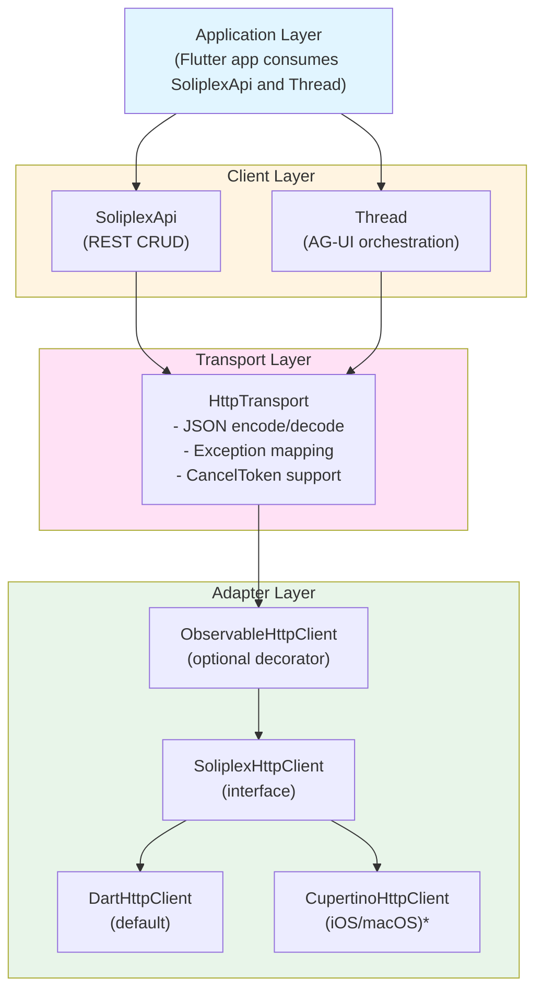
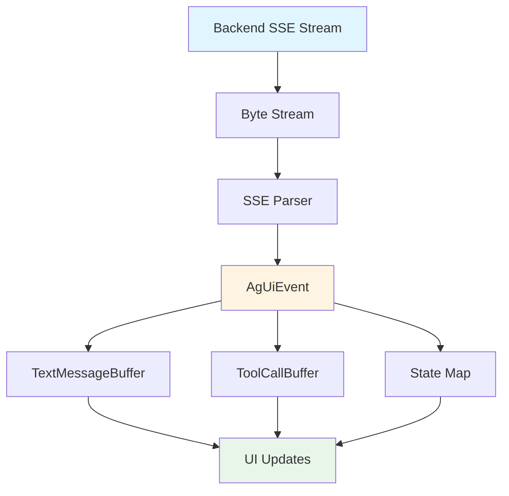

# soliplex_client Package

Pure Dart client library for the Soliplex backend. No Flutter dependencies - can be
used in any Dart environment (CLI, server, Flutter).

## Package Structure

```text
soliplex_client/lib/src/
├── agui/              # AG-UI streaming protocol
│   ├── agui_event.dart
│   ├── text_message_buffer.dart
│   ├── tool_call_buffer.dart
│   ├── tool_registry.dart
│   └── thread.dart
├── api/               # REST API client
│   └── soliplex_api.dart
├── errors/            # Exception hierarchy
│   └── exceptions.dart
├── http/              # HTTP transport layer
│   ├── dart_http_client.dart
│   ├── http_client_adapter.dart
│   ├── http_observer.dart
│   ├── http_response.dart
│   ├── http_transport.dart
│   ├── observable_http_client.dart
│   └── soliplex_http_client.dart
├── models/            # Data models
│   ├── chat_message.dart
│   ├── models.dart
│   ├── room.dart
│   ├── run_info.dart
│   └── thread_info.dart
└── utils/             # Utilities
    ├── cancel_token.dart
    └── url_builder.dart
```

## Architecture Overview

### Layered Design

The package follows a layered architecture with clear separation of concerns:



*Note: CupertinoHttpClient is in the soliplex_client_native package*

### Key Design Decisions

**1. Pluggable HTTP Clients**

The `SoliplexHttpClient` interface allows different HTTP implementations:

- `DartHttpClient` - Default pure-Dart implementation using `package:http`
- Platform clients (in `soliplex_client_native`) - CupertinoHttpClient for iOS/macOS
- `ObservableHttpClient` - Wraps any client to add monitoring

**2. Sealed Class Hierarchies**

Used extensively for type safety and exhaustive pattern matching:

- `ChatMessage` - Different message types (text, error, tool call, etc.)
- `RunState` - Run lifecycle states (no active, active, completed, failed)
- `TextMessageBuffer` - Buffer states (inactive vs active)
- `AgUiEvent` - 19 event types from the backend

**3. Immutable Data Models**

All models are `@immutable` with `copyWith()` methods:

- Prevents accidental mutation
- Thread-safe by design
- Enables value equality

**4. Event-Driven Streaming**

AG-UI uses Server-Sent Events (SSE) for real-time updates:



## Core Components

### SoliplexApi

High-level REST client for CRUD operations. Wraps `HttpTransport` and normalizes
backend responses.

```dart
final api = SoliplexApi(
  transport: HttpTransport(client: DartHttpClient()),
  urlBuilder: UrlBuilder('https://api.example.com/api/v1'),
);

// Room operations
final rooms = await api.getRooms();
final room = await api.getRoom('room-123');

// Thread operations
final threads = await api.getThreads('room-123');
final thread = await api.createThread('room-123');
await api.deleteThread('room-123', 'thread-456');

// Run operations
final run = await api.createRun('room-123', 'thread-456');
```

### Thread

Orchestrates AG-UI streaming. Manages buffers, state, and tool execution.

```dart
final thread = Thread(
  transport: httpTransport,
  urlBuilder: urlBuilder,
  roomId: 'room-123',
  threadId: 'thread-456',
  toolRegistry: registry,  // Optional client-side tools
);

// Stream events from a run
await for (final event in thread.run(
  runId: 'run-789',
  userMessage: 'Hello!',
  cancelToken: cancelToken,
)) {
  // Events are processed internally; yielded for observation
}

// Access accumulated state
print(thread.messages);  // List<ChatMessage>
print(thread.state);     // Map<String, dynamic>
print(thread.runState);  // RunState (sealed class)
```

**RunState sealed class:**

```dart
sealed class RunState {
  NoActiveRun()                      // No run executing
  ActiveRun(runId)                   // Run in progress
  CompletedRun(runId)                // Run finished successfully
  FailedRun(runId, errorMessage)     // Run encountered error
}
```

### HttpTransport

JSON serialization and exception mapping layer.

```dart
final transport = HttpTransport(
  client: DartHttpClient(),
  defaultTimeout: Duration(seconds: 30),
);

// Request with automatic JSON handling
final data = await transport.request<Map<String, dynamic>>(
  'POST',
  uri,
  body: {'message': 'Hello'},  // Auto-encoded to JSON
  fromJson: Room.fromJson,     // Auto-decoded response
  cancelToken: token,
);

// SSE streaming
final stream = transport.requestStream('POST', uri, body: body);
```

**Exception mapping:**

| Status Code | Exception |
|-------------|-----------|
| 401, 403    | `AuthException` |
| 404         | `NotFoundException` |
| Other 4xx/5xx | `ApiException` |
| Network errors | `NetworkException` |
| Cancelled | `CancelledException` |

### Buffers

Accumulate streaming content with immutable state transitions.

**TextMessageBuffer:**

```dart
// Start inactive
TextMessageBuffer buffer = TextMessageBuffer.empty;

// TEXT_MESSAGE_START event
buffer = buffer.start(messageId: 'msg-123');

// TEXT_MESSAGE_CONTENT events
if (buffer case ActiveTextBuffer active) {
  buffer = active.append('Hello, ');
  buffer = (buffer as ActiveTextBuffer).append('world!');
}

// TEXT_MESSAGE_END event
if (buffer case ActiveTextBuffer active) {
  final (newBuffer, message) = active.complete();
  buffer = newBuffer;  // Back to InactiveTextBuffer
  // message.text == 'Hello, world!'
}
```

**ToolCallBuffer:**

```dart
final buffer = ToolCallBuffer();

// TOOL_CALL_START event
buffer.startToolCall(callId: 'call-1', name: 'calculator');

// TOOL_CALL_ARGS events (streaming)
buffer.appendArgs(callId: 'call-1', delta: '{"a":');
buffer.appendArgs(callId: 'call-1', delta: '1,"b":2}');

// TOOL_CALL_END event
final toolCall = buffer.completeToolCall(callId: 'call-1');

// TOOL_CALL_RESULT event
buffer.setResult(callId: 'call-1', result: '3');
```

### ToolRegistry

Client-side tool execution for AG-UI.

```dart
final registry = ToolRegistry();

// Register a tool
registry.register(
  name: 'calculator',
  executor: (call) async {
    final args = jsonDecode(call.arguments);
    return ((args['a'] as num) + (args['b'] as num)).toString();
  },
);

// Fire-and-forget tool (side effects, no result needed)
registry.register(
  name: 'analytics',
  executor: (call) async { /* log event */ return ''; },
  fireAndForget: true,
);

// Execute
final result = await registry.execute(toolCallInfo);
```

## Data Models

### ChatMessage (Sealed Hierarchy)

```dart
sealed class ChatMessage {
  TextMessage       // Regular text, with streaming support
  ErrorMessage      // System-generated errors
  ToolCallMessage   // Contains List<ToolCallInfo>
  GenUiMessage      // Widget render data
  LoadingMessage    // Progress indicator
}

// TextMessage has streaming fields
TextMessage(
  text: 'Hello',
  isStreaming: true,       // Currently streaming
  thinkingText: '...',     // Reasoning content
  isThinkingStreaming: false,
);

// ToolCallInfo tracks status
ToolCallInfo(
  id: 'call-1',
  name: 'search',
  arguments: '{"query":"..."}',
  status: ToolCallStatus.executing,  // pending/executing/completed/failed
  result: '',
);
```

### Room, ThreadInfo, RunInfo

Simple immutable data classes with `fromJson()`, `toJson()`, `copyWith()`.

```dart
Room(id: 'room-1', name: 'General', description: '...', metadata: {});

ThreadInfo(
  id: 'thread-1',
  roomId: 'room-1',
  name: 'Thread',
  createdAt: DateTime.now(),
);

RunInfo(
  id: 'run-1',
  threadId: 'thread-1',
  status: RunStatus.running,  // pending/running/completed/failed/cancelled
);
```

## AG-UI Events

19 event types from the backend SSE stream:

**Run Lifecycle:**

- `RunStartedEvent` - Run began
- `RunFinishedEvent` - Run completed successfully
- `RunErrorEvent` - Run encountered error

**Steps:**

- `StepStartedEvent` - Step began
- `StepFinishedEvent` - Step completed

**Text Messages (streaming):**

- `TextMessageStartEvent` - Begin streaming message
- `TextMessageContentEvent` - Text chunk (delta)
- `TextMessageEndEvent` - Message complete

**Tool Calls (streaming):**

- `ToolCallStartEvent` - Tool call began
- `ToolCallArgsEvent` - Arguments chunk (delta)
- `ToolCallEndEvent` - Arguments complete
- `ToolCallResultEvent` - Result available

**State Management:**

- `StateSnapshotEvent` - Complete state replacement
- `StateDeltaEvent` - JSON Patch operations

**Activity:**

- `ActivitySnapshotEvent` - Complete activity state
- `ActivityDeltaEvent` - Activity JSON Patch

**Other:**

- `MessagesSnapshotEvent` - Replace all messages
- `CustomEvent` - Application-specific events
- `UnknownEvent` - Unrecognized event types

## HTTP Observability

### ObservableHttpClient

The `ObservableHttpClient` is a **decorator** that wraps any `SoliplexHttpClient` to
enable monitoring. It does **not** wrap clients automatically - you must explicitly
compose it:

```dart
// Without observation (default)
final transport = HttpTransport(client: DartHttpClient());

// With observation (explicit wrapping required)
final observable = ObservableHttpClient(
  client: DartHttpClient(),
  observers: [LoggingObserver(), MetricsObserver()],
);
final transport = HttpTransport(client: observable);
```

### Observer Interface

```dart
abstract class HttpObserver {
  void onRequest(HttpRequestEvent event);
  void onResponse(HttpResponseEvent event);
  void onError(HttpErrorEvent event);
  void onStreamStart(HttpStreamStartEvent event);
  void onStreamEnd(HttpStreamEndEvent event);
}
```

### What Gets Observed

**For regular requests (`request()`):**

| Event | When |
|-------|------|
| `onRequest()` | Before request starts |
| `onResponse()` | After successful response |
| `onError()` | When `SoliplexException` is thrown |

**For streaming (`requestStream()`):**

| Event | When |
|-------|------|
| `onStreamStart()` | When stream begins |
| `onStreamEnd()` | When stream completes or errors (includes byte count) |

### Observability with DartHttpClient

When `ObservableHttpClient` wraps `DartHttpClient`, **all real-world network
transactions are visible** because `DartHttpClient` converts network errors to
`SoliplexException` subtypes:

| Original Exception | Converted To |
|--------------------|--------------|
| `TimeoutException` | `NetworkException(isTimeout: true)` |
| `SocketException` | `NetworkException` |
| `HttpException` | `NetworkException` |
| `http.ClientException` | `NetworkException` |

Since `ObservableHttpClient` catches `SoliplexException`, all these trigger
`onError()`.

**Edge cases not observed:**

1. `StateError` from using a closed client (programming error)
2. Non-`SocketException` errors during streaming that aren't wrapped
   (rare edge case in `DartHttpClient.requestStream()`)

These are programming errors or rare edge cases, not normal network operations.

### Request Correlation

Each request gets a unique ID for correlating request/response/error events:

```dart
class MyObserver extends HttpObserver {
  @override
  void onRequest(HttpRequestEvent event) {
    print('[${event.requestId}] ${event.method} ${event.uri}');
  }

  @override
  void onResponse(HttpResponseEvent event) {
    print('[${event.requestId}] ${event.statusCode} '
        'in ${event.duration.inMilliseconds}ms');
  }
}
```

## Exception Hierarchy

```text
SoliplexException (abstract)
├── AuthException        - 401/403, redirect to login
├── NetworkException     - Connection failed, show retry
├── ApiException         - 4xx/5xx, show error message
├── NotFoundException    - 404, navigate away
└── CancelledException   - User cancelled, handle silently
```

All exceptions preserve `originalError` and `stackTrace` for debugging.

## Data Flow Examples

### REST API Call

```text
api.getRoom('room-123')
  ↓
HttpTransport.request<Room>()
  ↓
[ObservableHttpClient.request() - if wrapped]
  ↓
DartHttpClient.request()
  ↓
Network request
  ↓
HttpResponse
  ↓
Status code check → throw if error
  ↓
JSON decode
  ↓
Room.fromJson()
  ↓
Room object
```

### AG-UI Streaming

```text
thread.run(runId, userMessage)
  ↓
POST /rooms/{roomId}/agui/{threadId}
  ↓
SSE byte stream
  ↓
UTF-8 decode → buffer until \n\n
  ↓
Parse "data: {...}" lines
  ↓
AgUiEvent.fromJson() → typed event
  ↓
thread.processEvent()
  ├── TextMessage* → TextMessageBuffer → TextMessage
  ├── ToolCall* → ToolCallBuffer → ToolCallInfo → execute
  ├── State* → JSON Patch → _state map
  └── RunFinished/Error → RunState update
  ↓
yield event to consumer
```

## Design Patterns Summary

| Pattern | Usage |
|---------|-------|
| **Adapter** | `SoliplexHttpClient` interface with `DartHttpClient` implementation |
| **Decorator** | `ObservableHttpClient` wraps clients with monitoring (manual) |
| **Factory** | `AgUiEvent.fromJson()` creates appropriate event subclass |
| **Repository** | `SoliplexApi` abstracts backend communication |
| **State Machine** | `RunState` sealed class for run lifecycle |
| **Buffer/Accumulator** | `TextMessageBuffer`, `ToolCallBuffer` for streaming |
| **Registry** | `ToolRegistry` for client-side tool registration |
| **Observer** | `HttpObserver` for HTTP monitoring |

## Dependencies

- **http** (^1.2.0) - Pure Dart HTTP client
- **meta** (^1.9.0) - `@immutable` annotation
